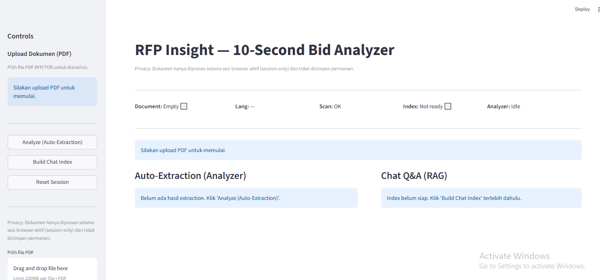

# RFP Insight



**AI-Powered RFP Analyzer & Chat Assistant (RAG-based)**

RFP Insight adalah aplikasi AI-assisted document intelligence untuk membantu tim non-teknis (Business, Procurement, Sales) memahami dokumen Request for Proposal (RFP) dengan cepat dan akurat.

Aplikasi ini menggabungkan:
* Whole-document analysis (ekstraksi field penting)
* Retrieval-Augmented Generation (RAG) untuk Q&A berbasis dokumen
* Evidence-backed answers dengan preview halaman PDF
* UX & guardrails yang siap dipakai oleh non-technical user

🎯 **Target utama**: "10-second bid understanding" — pahami isi RFP tanpa membaca puluhan halaman.

---

## ✨ Key Features

### 📄 Document Ingestion
* Upload PDF-only (guardrail MIME & size)
* Per-page text extraction (PyMuPDF)
* Deteksi:
   * Bahasa dokumen (ID / EN)
   * PDF hasil scan (text minim)

### 🧠 Analyzer (Whole-Document)
* Ekstraksi field utama:
   * Project title
   * Submission deadline
   * Budget limit
   * Technical requirements summary
* Output:
   * Tabel ringkas (human-readable)
   * JSON terstruktur (Pydantic-validated)
* Latency tracking (ms)

### 🔍 Evidence & Page Preview
* Evidence berbasis:
   * `page_number`
   * `text snippet`
* Tombol View Page
   * Render halaman PDF → PNG
   * Cached (tidak reprocess dokumen)
* Transparansi & auditability

### 💬 Chat with Document (RAG)
* Semantic search (SentenceSplitter 1024)
* In-memory vector index (Google Gemini Embeddings)
* Multi-turn chat dengan history
* Strict out-of-context refusal
   * Tidak halusinasi
   * Jawaban selalu berbasis dokumen
* Citation otomatis (page number)

### 🧯 UX, Guardrails & Failure Handling
* Loading & status indicator
* Friendly error mapping (quota / timeout)
* Disable tombol saat proses berjalan
* Reset session bersih (doc, index, chat)
* Corporate dashboard layout (Streamlit)

---

## 🏗️ Architecture Overview
```
app.py
 ├── ingestion/
 │   ├── pdf_loader.py        # PDF → PageText
 │   ├── text_cleaner.py
 │   └── language.py          # Language & scan detection
 │
 ├── extraction/
 │   ├── analyzer.py          # Whole-doc LLM extraction
 │   └── evidence_builder.py  # Page + snippet evidence
 │
 ├── rag/
 │   ├── indexing.py          # Chunking + embedding + index
 │   └── chat_engine.py       # Retrieval + Gemini generation
 │
 ├── ui/
 │   ├── state.py             # Session-state contract
 │   ├── messages.py          # Copywriting & UX text
 │   └── components.py        # Dashboard layout
 │
 └── utils/
     └── error_handling.py
```

**Design principles:**
* Thin `app.py` (orchestration only)
* UI ↔ Pipeline contract via `ui/state.py`
* No hidden global state
* Defensive programming (non-crashing UX)

---

## 🧱 Tech Stack

| Layer | Technology |
|-------|-----------|
| UI | Streamlit |
| PDF Processing | PyMuPDF |
| LLM | Google Gemini |
| Embeddings | Gemini Embedding |
| RAG | LlamaIndex |
| Validation | Pydantic |
| Language | Python 3.11+ |

---

## 🚀 Getting Started

### 1. Clone Repository
```bash
git clone https://github.com/your-username/rfp-insight.git
cd rfp-insight
```

### 2. Create Virtual Environment
```bash
python -m venv .venv
source .venv/bin/activate  # Windows: .venv\Scripts\activate
```

### 3. Install Dependencies
```bash
pip install -r requirements.txt
```

### 4. Set API Key
```bash
export GOOGLE_API_KEY="your_api_key_here"
```

atau via `.streamlit/secrets.toml`:
```toml
GOOGLE_API_KEY = "your_api_key_here"
```

### 5. Run App
```bash
streamlit run app.py
```

---

## 🧪 Typical User Flow

1. **Upload PDF RFP**
2. **Analyzer** → lihat key fields + JSON
3. **Build Chat Index**
4. **Tanya jawab** berbasis dokumen
5. **Klik evidence** → preview halaman

---

## 🛡️ Guardrails & Safety

* PDF-only validation
* Size limit
* Out-of-context refusal (hard-coded, exact)
* No hallucinated answers
* Cached rendering (efisien & aman)

---

## 📌 Project Status

**Status**: ✅ Completed (Production-ready prototype)

**Focus**: UX clarity, robustness, explainability

**Next possible extensions**:
* Persistent vector DB (Qdrant / FAISS)
* Multi-document comparison
* Export summary (DOCX / PPT)
* Role-based access

---

## 👤 Author

**Ardiyanto**  
AI / ML Engineer (focus: RAG systems & document intelligence)

---

## 📄 License

MIT License
